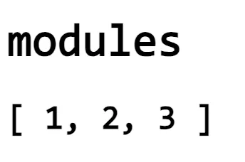
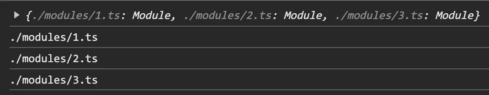
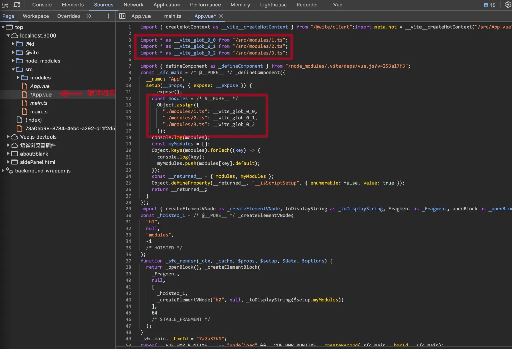
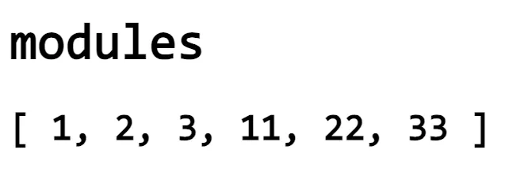
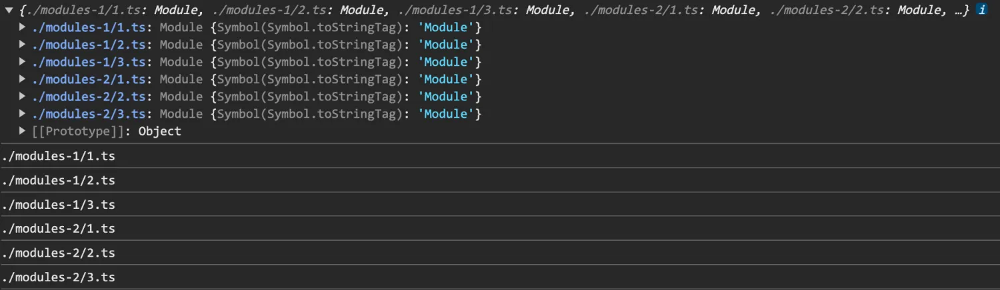
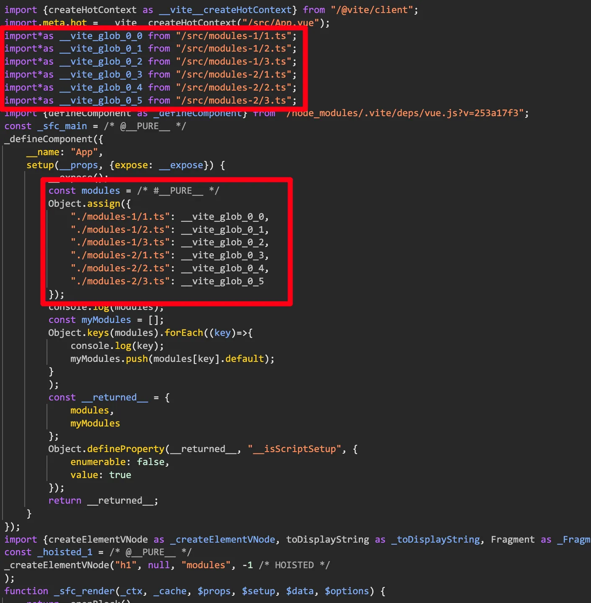
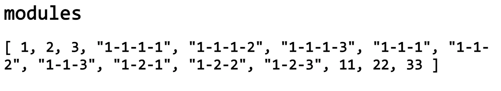
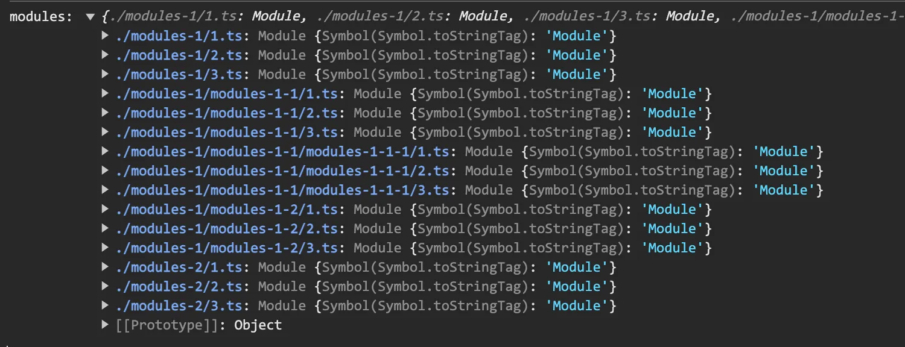
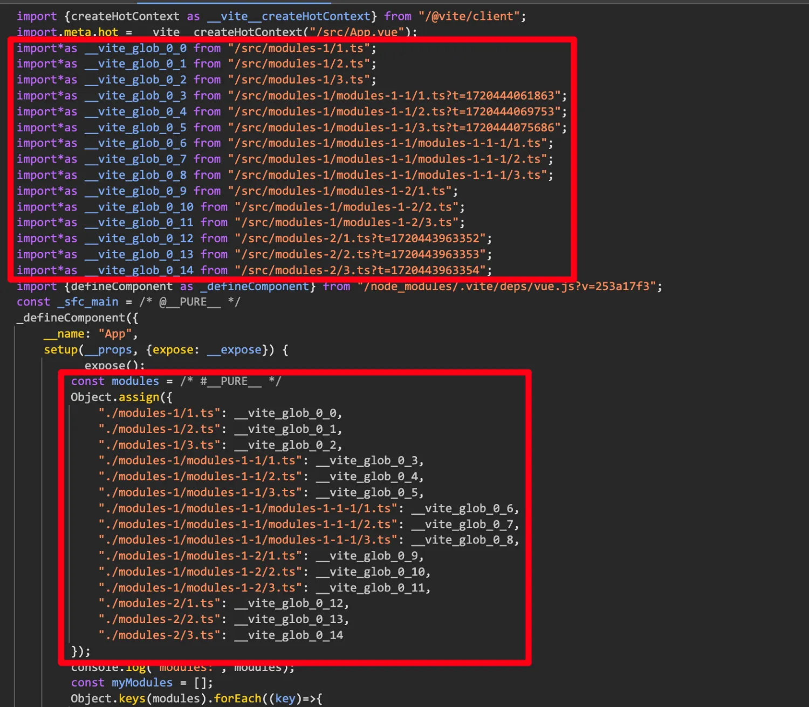

# [0002. 一次性导入所有模块](https://github.com/tnotesjs/TNotes.vite/tree/main/notes/0002.%20%E4%B8%80%E6%AC%A1%E6%80%A7%E5%AF%BC%E5%85%A5%E6%89%80%E6%9C%89%E6%A8%A1%E5%9D%97)

<!-- region:toc -->

- [1. 概述](#1-概述)
- [2. References](#2-references)
- [3. `import.meta.glob` 的一些常见用法](#3-importmetaglob-的一些常见用法)
- [4. 理解语法糖 `import.meta.glob` 的基本原理](#4-理解语法糖-importmetaglob-的基本原理)
- [5. demo1 - 导入 modules 中的所有 .ts 文件](#5-demo1---导入-modules-中的所有-ts-文件)
- [6. demo2 - 导入 modules-1 和 modules-2 中的所有 .ts 文件](#6-demo2---导入-modules-1-和-modules-2-中的所有-ts-文件)
- [7. demo3 - 递归导入](#7-demo3---递归导入)

<!-- endregion:toc -->

## 1. 概述

- 本文内容：介绍 `import.meta.glob` 的基本使用

## 2. References

::: details

- https://vitejs.dev/guide/features.html#glob-import
  - vite 官方文档 -- Vite，Features，Glob Import

:::

## 3. `import.meta.glob` 的一些常见用法

- 从 **指定单一目录** 中导入满足要求的所有模块。

```ts
import.meta.glob('./modules/*.ts', { eager: true })
```

- 从 **多个目录** 中导入满足要求的所有模块。

```ts
const modules = import.meta.glob(['./modules-1/*.ts', './modules-2/*.ts'], {
  eager: true,
})
```

- **递归导入** 的写法。

```ts
const modules = import.meta.glob(['./modules-1/**/*.ts', './modules-2/*.ts'], {
  eager: true,
})
// ./modules-1/**/*.ts
// 这么写意味着从 modules-1 中导入所有所有模块
// 包括那些嵌套的模块也会被导入

// ./modules-2/*.ts
// 这么写意味着仅导入一层
// 不包括嵌套的模块
```

- 匹配 **多种后缀** 的写法。

```ts
const modules = import.meta.glob(
  ['./modules-1/**/*.{json,ts,js}', './modules-2/*.ts'],
  { eager: true },
)
// './modules-1/**/*.{json,ts,js}'
// 导入 modules-1 目录下的所有模块
// 包括嵌套模块
// 这些模块以 json 或 ts 或 js 为后缀
```

## 4. 理解语法糖 `import.meta.glob` 的基本原理

- 问：语法糖 `import.meta.glob(..., { eager: true })` 的等效写法（编译结果）是什么？

```ts
const modules = import.meta.glob('./modules/*.ts', { eager: true })

// 假设目录结构如下
// ├── App.vue # 在 App.vue 中导入 modules 下的所有模块
// ├── main.ts
// ├── modules
// │   ├── 1.ts
// │   ├── 2.ts
// │   └── 3.ts
// └── vite-env.d.ts

// 经过 vite 编译后，生成的结果如下。
import * as __vite_glob_0_0 from '/src/modules/1.ts'
import * as __vite_glob_0_1 from '/src/modules/2.ts'
import * as __vite_glob_0_2 from '/src/modules/3.ts'

const modules = Object.assign({
  './modules/1.ts': __vite_glob_0_0,
  './modules/2.ts': __vite_glob_0_1,
  './modules/3.ts': __vite_glob_0_2,
})

// 相当于一个语法糖
// 将所有的模块一次性导入
// 然后以模块的相对路径为 key
// 模块导出的内容为 val
// 形成一个对象返回
```

## 5. demo1 - 导入 modules 中的所有 .ts 文件

- src 目录结构

```bash
$ tree
.
├── App.vue # 在 App.vue 中导入 modules 下的所有模块
├── main.ts
├── modules
│   ├── 1.ts
│   ├── 2.ts
│   └── 3.ts
└── vite-env.d.ts
```

- 模块内容

```ts
// src/modules/1.ts
export const a = 1
export default 1
```

```ts
// src/modules/2.ts
export const b = 2
export default 2
```

```ts
// src/modules/3.ts
export const c = 3
export default 3
```

- 导入测试

```vue
<!-- src/App.vue -->
<script setup lang="ts">
const modules = import.meta.glob('./modules/*.ts', { eager: true }) as Record<
  string,
  any
>
console.log(modules)
// {
//     "./modules/1.ts": {
//         "a": 1,
//         "default": 1
//     },
//     "./modules/2.ts": {
//         "b": 2,
//         "default": 2
//     },
//     "./modules/3.ts": {
//         "c": 3,
//         "default": 3
//     }
// }

const myModules: any[] = []
Object.keys(modules).forEach((key) => {
  console.log(key)
  // ./modules/1.ts
  // ./modules/2.ts
  // ./modules/3.ts

  myModules.push(modules[key].default)
})
</script>

<template>
  <h1>modules</h1>
  <h2>{{ myModules }}</h2>
</template>
```

- **最终效果**
  - 
  - 
- **编译结果分析**

```ts
const modules = import.meta.glob('./modules/*.ts', { eager: true })
// 经过 vite 编译后，生成的结果如下。
import * as __vite_glob_0_0 from '/src/modules/1.ts'
import * as __vite_glob_0_1 from '/src/modules/2.ts'
import * as __vite_glob_0_2 from '/src/modules/3.ts'

const modules = Object.assign({
  './modules/1.ts': __vite_glob_0_0,
  './modules/2.ts': __vite_glob_0_1,
  './modules/3.ts': __vite_glob_0_2,
})

// 相当于一个语法糖
// 将所有的模块一次性导入
// 然后以模块的相对路径为 key
// 模块导出的内容为 val
// 形成一个对象返回
```



```ts
// App.vue（编译结果）
import { createHotContext as __vite__createHotContext } from '/@vite/client'
import.meta.hot = __vite__createHotContext('/src/App.vue')

import * as __vite_glob_0_0 from '/src/modules/1.ts'
import * as __vite_glob_0_1 from '/src/modules/2.ts'
import * as __vite_glob_0_2 from '/src/modules/3.ts'

import { defineComponent as _defineComponent } from '/node_modules/.vite/deps/vue.js?v=253a17f3'
const _sfc_main = /* @__PURE__ */ _defineComponent({
  __name: 'App',
  setup(__props, { expose: __expose }) {
    __expose()
    const modules =
      /* #__PURE__ */
      Object.assign({
        './modules/1.ts': __vite_glob_0_0,
        './modules/2.ts': __vite_glob_0_1,
        './modules/3.ts': __vite_glob_0_2,
      })
    console.log(modules)
    const myModules = []
    Object.keys(modules).forEach((key) => {
      console.log(key)
      myModules.push(modules[key].default)
    })
    const __returned__ = { modules, myModules }
    Object.defineProperty(__returned__, '__isScriptSetup', {
      enumerable: false,
      value: true,
    })
    return __returned__
  },
})
import {
  createElementVNode as _createElementVNode,
  toDisplayString as _toDisplayString,
  Fragment as _Fragment,
  openBlock as _openBlock,
  createElementBlock as _createElementBlock,
} from '/node_modules/.vite/deps/vue.js?v=253a17f3'
const _hoisted_1 = /* @__PURE__ */ _createElementVNode(
  'h1',
  null,
  'modules',
  -1,
  /* HOISTED */
)
function _sfc_render(_ctx, _cache, $props, $setup, $data, $options) {
  return (
    _openBlock(),
    _createElementBlock(
      _Fragment,
      null,
      [
        _hoisted_1,
        _createElementVNode('h2', null, _toDisplayString($setup.myModules)),
      ],
      64,
      /* STABLE_FRAGMENT */
    )
  )
}
_sfc_main.__hmrId = '7a7a37b1'
typeof __VUE_HMR_RUNTIME__ !== 'undefined' &&
  __VUE_HMR_RUNTIME__.createRecord(_sfc_main.__hmrId, _sfc_main)
import.meta.hot.accept((mod) => {
  if (!mod) return
  const { default: updated, _rerender_only } = mod
  if (_rerender_only) {
    __VUE_HMR_RUNTIME__.rerender(updated.__hmrId, updated.render)
  } else {
    __VUE_HMR_RUNTIME__.reload(updated.__hmrId, updated)
  }
})
import _export_sfc from '/@id/__x00__plugin-vue:export-helper'
export default /* @__PURE__ */ _export_sfc(_sfc_main, [
  ['render', _sfc_render],
  ['__file', '/Users/huyouda/Desktop/vite-project/src/App.vue'],
])

//# sourceMappingURL=data:application/json;base64,eyJ2ZXJzaW9uIjozLCJtYXBwaW5ncyI6Ijs7Ozs7QUFDQSxVQUFNLFVBQVUsWUFBWSxLQUFLLGtCQUFrQixFQUFFLE9BQU8sS0FBSyxDQUFDO0FBQ2xFLFlBQVEsSUFBSSxPQUFPO0FBZ0JuQixVQUFNLFlBQW1CLENBQUM7QUFDMUIsV0FBTyxLQUFLLE9BQU8sRUFBRSxRQUFRLENBQUMsUUFBUTtBQUNwQyxjQUFRLElBQUksR0FBRztBQUtmLGdCQUFVLEtBQUssUUFBUSxHQUFHLEVBQUUsT0FBTztBQUFBLElBQ3JDLENBQUM7Ozs7Ozs7bUJBSUM7QUFBQSxFQUFnQjtBQUFBO0FBQUEsRUFBWjtBQUFBLEVBQU87QUFBQTtBQUFBOzt1QkE5QmI7QUFBQTtBQUFBO0FBQUE7QUFBQSxNQThCRTtBQUFBLE1BQ0Esb0JBQXdCLDZCQUFqQixnQkFBUztBQUFBIiwibmFtZXMiOltdLCJpZ25vcmVMaXN0IjpbXSwic291cmNlcyI6WyJBcHAudnVlIl0sInNvdXJjZXNDb250ZW50IjpbIjxzY3JpcHQgc2V0dXAgbGFuZz1cInRzXCI+XG5jb25zdCBtb2R1bGVzID0gaW1wb3J0Lm1ldGEuZ2xvYignLi9tb2R1bGVzLyoudHMnLCB7IGVhZ2VyOiB0cnVlIH0pIGFzIFJlY29yZDxzdHJpbmcsIGFueT5cbmNvbnNvbGUubG9nKG1vZHVsZXMpXG4vLyB7XG4vLyAgICAgXCIuL21vZHVsZXMvMS50c1wiOiB7XG4vLyAgICAgICAgIFwiYVwiOiAxLFxuLy8gICAgICAgICBcImRlZmF1bHRcIjogMVxuLy8gICAgIH0sXG4vLyAgICAgXCIuL21vZHVsZXMvMi50c1wiOiB7XG4vLyAgICAgICAgIFwiYlwiOiAxLFxuLy8gICAgICAgICBcImRlZmF1bHRcIjogMlxuLy8gICAgIH0sXG4vLyAgICAgXCIuL21vZHVsZXMvMy50c1wiOiB7XG4vLyAgICAgICAgIFwiY1wiOiAzLFxuLy8gICAgICAgICBcImRlZmF1bHRcIjogM1xuLy8gICAgIH1cbi8vIH1cblxuY29uc3QgbXlNb2R1bGVzOiBhbnlbXSA9IFtdXG5PYmplY3Qua2V5cyhtb2R1bGVzKS5mb3JFYWNoKChrZXkpID0+IHtcbiAgY29uc29sZS5sb2coa2V5KVxuICAvLyAuL21vZHVsZXMvMS50c1xuICAvLyAuL21vZHVsZXMvMi50c1xuICAvLyAuL21vZHVsZXMvMy50c1xuXG4gIG15TW9kdWxlcy5wdXNoKG1vZHVsZXNba2V5XS5kZWZhdWx0KVxufSlcbjwvc2NyaXB0PlxuXG48dGVtcGxhdGU+XG4gIDxoMT5tb2R1bGVzPC9oMT5cbiAgPGgyPnt7IG15TW9kdWxlcyB9fTwvaDI+XG48L3RlbXBsYXRlPlxuIl0sImZpbGUiOiIvVXNlcnMvaHV5b3VkYS9EZXNrdG9wL3ZpdGUtcHJvamVjdC9zcmMvQXBwLnZ1ZSJ9
```

## 6. demo2 - 导入 modules-1 和 modules-2 中的所有 .ts 文件

- src 目录结构

```bash
$ tree
├── App.vue # 在 App.vue 中，捞出 modules-1 和 modules-2 中的所有 .ts 文件
├── main.ts
├── modules-1
│   ├── 1.ts
│   ├── 2.ts
│   └── 3.ts
├── modules-2
│   ├── 1.ts
│   ├── 2.ts
│   └── 3.ts
└── vite-env.d.ts
```

- 实现方式分析
  - **做法 1：**可以和 demo1 的写法保持一致，写两条 `import.meta.glob` 语句就行。
  - **做法 2：**`import.meta.glob` 的第一个参数可以传入一个字符串数组，将所有需要导入的模块丢里边即可。
- 导入测试

```vue
<!-- App.vue -->
<script setup lang="ts">
const modules = import.meta.glob(['./modules-1/*.ts', './modules-2/*.ts'], {
  eager: true,
}) as Record<string, any>
console.log(modules)
// {
//     "./modules-1/1.ts": {
//         "a": 1,
//         "default": 1
//     },
//     "./modules-1/2.ts": {
//         "b": 2,
//         "default": 2
//     },
//     "./modules-1/3.ts": {
//         "c": 3,
//         "default": 3
//     },
//     "./modules-2/1.ts": {
//         "a": 11,
//         "default": 11
//     },
//     "./modules-2/2.ts": {
//         "b": 22,
//         "default": 22
//     },
//     "./modules-2/3.ts": {
//         "c": 33,
//         "default": 33
//     }
// }

const myModules: any[] = []
Object.keys(modules).forEach((key) => {
  console.log(key)
  // ./modules-1/1.ts
  // ./modules-1/2.ts
  // ./modules-1/3.ts
  // ./modules-2/1.ts
  // ./modules-2/2.ts
  // ./modules-2/3.ts

  myModules.push(modules[key].default)
})
</script>

<template>
  <h1>modules</h1>
  <h2>{{ myModules }}</h2>
</template>
```

- 最终效果
  - 
  - 
- 编译结果
  - 

## 7. demo3 - 递归导入

- src 目录结构

```bash
$ tree
├── App.vue # 导入所有 modules
├── main.ts
├── modules-1
│   ├── 1.ts
│   ├── 2.ts
│   ├── 3.ts
│   ├── modules-1-1
│   │   ├── 1.ts
│   │   ├── 2.ts
│   │   ├── 3.ts
│   │   └── modules-1-1-1
│   │       ├── 1.ts
│   │       ├── 2.ts
│   │       └── 3.ts
│   └── modules-1-2
│       ├── 1.ts
│       ├── 2.ts
│       └── 3.ts
├── modules-2
│   ├── 1.ts
│   ├── 2.ts
│   └── 3.ts
└── vite-env.d.ts
```

- 实现方式分析
  - `./modules-1/**/*.ts`，路径这么写，意味着递归匹配 modules-1 目录下的所有 .ts 模块。
- 导入测试

```vue
<!-- App.vue -->
<script setup lang="ts">
const modules = import.meta.glob(['./modules-1/**/*.ts', './modules-2/*.ts'], {
  eager: true,
}) as Record<string, any>
console.log('modules:', modules)

// './modules-1/**/*.ts'
// ** 表示匹配任意子目录，它会递归地匹配所有文件。
const myModules: any[] = []
Object.keys(modules).forEach((key) => {
  myModules.push(modules[key].default)
})
</script>

<template>
  <h1>modules</h1>
  <h2>{{ myModules }}</h2>
</template>
```

- 最终效果
  - 
  - 
- 编译结果
  - 
