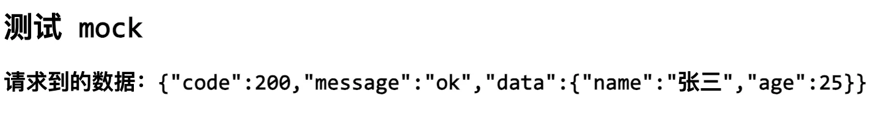

# [0003. vite-plugin-mock 的基本使用](https://github.com/tnotesjs/TNotes.vite/tree/main/notes/0003.%20vite-plugin-mock%20%E7%9A%84%E5%9F%BA%E6%9C%AC%E4%BD%BF%E7%94%A8)

<!-- region:toc -->

- [1. 概述](#1-概述)
- [2. References](#2-references)
- [3. demo](#3-demo)

<!-- endregion:toc -->

## 1. 概述

- 本节内容：vite-plugin-mock 的基本使用。
- 在 Vite 中使用 mock 数据是一个非常实用的功能，如果跟负责写后端的朋友接口还没写好，前端可以自行根据接口文档的要求来 mock 数据。做法很简单，在下面的 demo 中记录基本流程。

## 2. References

::: details

- https://www.npmjs.com/package/vite-plugin-mock
  - NPM，vite-plugin-mock。
- https://github.com/vbenjs/vite-plugin-mock/tree/main#readme
  - Github，vite-plugin-mock。介绍了该插件的基本使用，以及一些字段的描述。

:::

## 3. demo

- 初始化

```bash
# 初始化包，并安装必要的依赖

# 初始化包
$ pnpm init
# 安装必要的依赖
$ pnpm install vite-plugin-mock vite mock @types/node

# vite-plugin-mock 一个可以帮助你拦截网络请求并提供模拟数据的库。
# vite 构建工具
# mock 模拟数据的库
# @types/node 这是 nodejs 环境下的一些类型声明文件
```

- 检查一下 package.json 包体描述文件，确保相关依赖项都成功安装。

```json
{
  "name": "vite-mock-demo",
  "version": "1.0.0",
  "description": "",
  "main": "index.js",
  "scripts": {
    "test": "echo \"Error: no test specified\" && exit 1"
  },
  "keywords": [],
  "author": "",
  "license": "ISC",
  "dependencies": {
    "@types/node": "^20.14.6",
    "mock": "^0.1.1",
    "vite": "^5.3.1",
    "vite-plugin-mock": "^3.0.2"
  }
}
```

- 在 vite 配置文件中添加 vite-plugin-mock 插件
- 配置 vite 插件，将插件 `vite-plugin-mock` 丢到 vite 的 plugins 字段中。
- **配置 mockPath 字段**：需要告知它咱们的 mock 数据存在在什么位置，比如在本地的 mock 目录下面的话，那么 `mockPath` 的值传入 `'mock'` 即可。
- **配置 enable 字段**：`enable` 表示生效的条件，这里可以通过启动方式来区分，如果是开发环境启动的话，那么启用 mock，否则关闭 mock。

```javascript
import { defineConfig } from 'vite'
import { viteMockServe } from 'vite-plugin-mock'

export default defineConfig({
  server: {
    port: 3000, // 端口号改为 3000（默认端口是 5173，若端口号冲突了，可以在这里自定义端口）
    open: true, // 自动打开浏览器
  },
  plugins: [
    viteMockServe({
      // 指定存放 mock 文件的文件夹
      mockPath: 'mock',

      // 在开发环境启用 mock 功能
      enable: process.env.NODE_ENV === 'development',
    }),
  ],
})
```

- 准备 mock 数据：配置完插件之后，下一步就是准备 mock 数据了，可以在你的项目根目录下，创建一个名为 `mock` 的文件夹，并在其中创建一个或多个 mock 数据文件。
- 例如，你可以创建一个名为 `user.ts` 的文件来模拟用户数据：

```javascript
export default [
  {
    url: '/api/user',
    method: 'get',
    response: () => {
      return {
        code: 200,
        message: 'ok',
        data: {
          name: '张三',
          age: 25,
        },
      }
    },
  },
]
```

- 接下来，当你的前端应用尝试通过 GET 请求访问 `/api/user` 时，`vite-plugin-mock` 将拦截这个请求并返回上面定义的模拟数据。
- 准备测试接口

```html
<!DOCTYPE html>
<html lang="en">
  <head>
    <meta charset="UTF-8" />
    <meta name="viewport" content="width=device-width, initial-scale=1.0" />
    <title>vite-mock-demo</title>
  </head>
  <body>
    <h1>测试 mock</h1>
    <h2>请求到的数据：<span id="mock-data"></span></h2>
    <script>
      fetch('/api/user')
        .then((res) => res.json())
        .then((data) => {
          console.log(data)
          document.getElementById('mock-data').textContent =
            JSON.stringify(data)
        })
    </script>
  </body>
</html>
```

- 然后，在你的应用中发起到 `/api/user` 的请求，你将看到返回的模拟数据。
- 启动 demo

```bash
# 启动你的 Vite 开发服务器
$ npx vite
```

- 最终效果如下图所示。
- 
