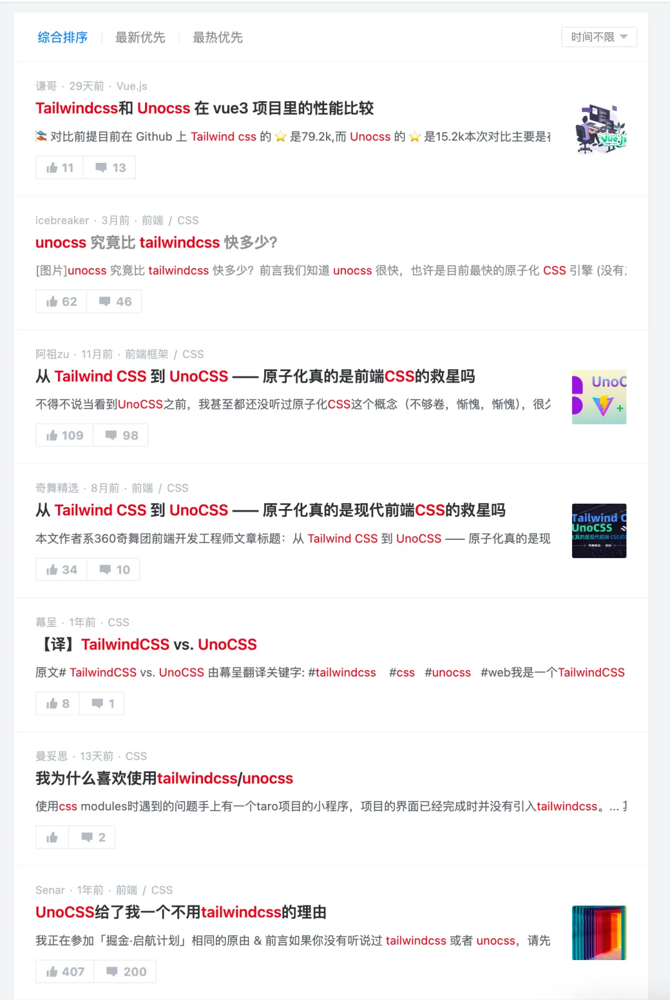

# [0006. UnoCSS 学习资源](https://github.com/tnotesjs/TNotes.vite/tree/main/notes/0006.%20UnoCSS%20%E5%AD%A6%E4%B9%A0%E8%B5%84%E6%BA%90)

<!-- region:toc -->

- [1. 概述](#1-概述)
- [2. References - UnoCSS 官方内容](#2-references---unocss-官方内容)
- [3. References - 掘金小册](#3-references---掘金小册)
- [4. References - VSCode 插件](#4-references---vscode-插件)
- [5. References - 其他原子 CSS 引擎 - tailwindcss](#5-references---其他原子-css-引擎---tailwindcss)
- [6. References - 其他原子 CSS 引擎 - windicss](#6-references---其他原子-css-引擎---windicss)
- [7. References - 掘金文章](#7-references---掘金文章)

<!-- endregion:toc -->

## 1. 概述

- 本文记录和 UnoCSS 相关的一些链接

## 2. References - UnoCSS 官方内容

::: details

- https://unocss.dev/
  - 这是 UnoCSS 官方文档。
- https://github.com/unocss/unocss
  - 这是 UnoCSS 的 GitHub 仓库。

:::

## 3. References - 掘金小册

::: details

- 《CSS 工程化核心原理与实战》
  - https://s.juejin.cn/ds/i6QXfsta/ ⬅️ 推广链接。
  - 这篇小册中介绍了 CSS 工程化相关的知识点，在“原子化篇”中，对 Tailwind CSS 和 UnoCSS 的使用都有所介绍。

> 补充：
>
> 如果有需要的话，可以通过上述推广链接下单支持一下（有几块钱的推广费）。感谢 🙏 🙏 🙏。

:::

## 4. References - VSCode 插件

::: details

- https://marketplace.visualstudio.com/items?itemName=antfu.unocss
  - VS Code，UnoCSS 插件。
- https://marketplace.visualstudio.com/items?itemName=stivo.tailwind-fold
  - VS Code，Tailwind Fold 插件。
- https://marketplace.visualstudio.com/items?itemName=omkarbhede.tailwindcss-tune
  - VSCode，TailwindCSS Tune 插件。

:::

## 5. References - 其他原子 CSS 引擎 - tailwindcss

::: details

- https://tailwindcss.com/
  - 这是 tailwindcss 官方文档。
- https://github.com/tailwindlabs/tailwindcss
  - 这是 tailwindcss 的 GitHub 仓库。

:::

## 6. References - 其他原子 CSS 引擎 - windicss

::: details

- https://windicss.org/
  - 这是 windicss 官方文档。
- https://github.com/windicss/windicss
  - 这是 windicss 的 GitHub 仓库。

:::

## 7. References - 掘金文章

::: details

在 juejin 上搜索 UnoCSS、TailwindCSS 这些关键字，有不少相关的内容。

:::
